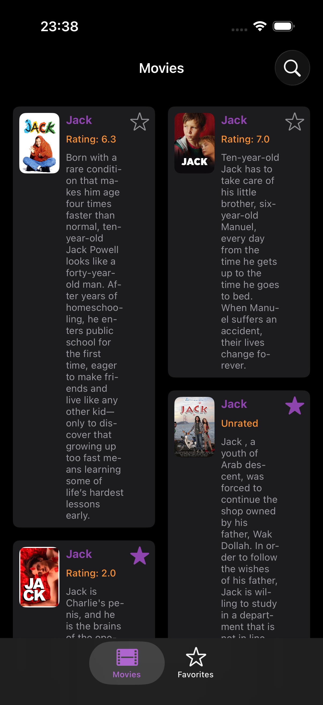
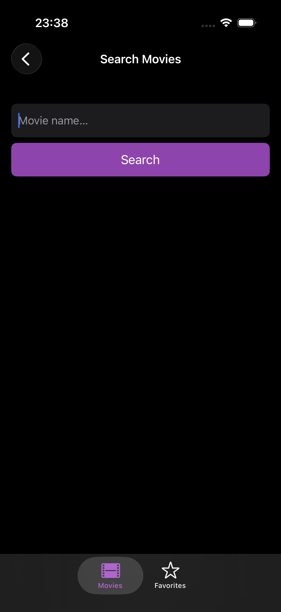
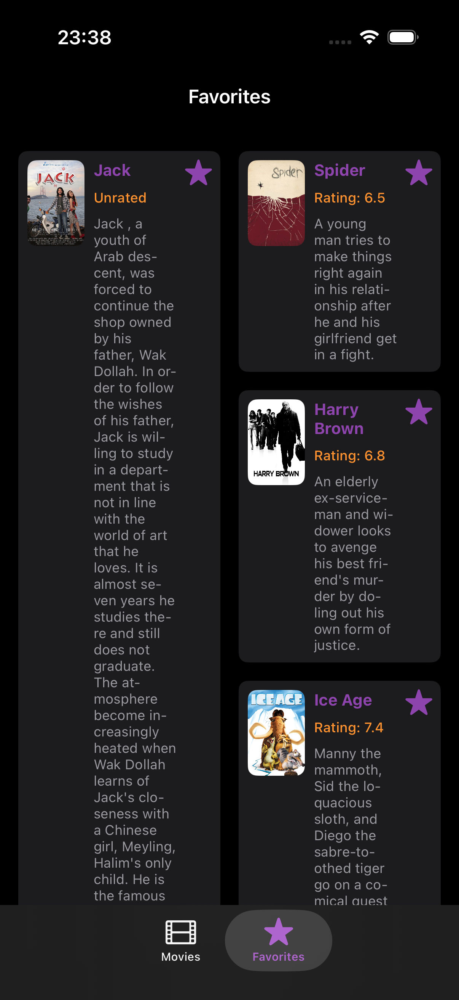
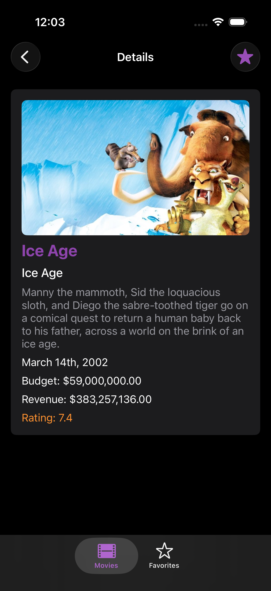

# 🎬 FILM BOX

Film Box is an application that allows you to search for movies and get detailed information using data provided by the [TMDB API](https://developer.themoviedb.org/docs/getting-started).

  
  
  
  

## ✨ Features

### 📋 Movie List
Displays movies searched by the user with the following information: photo, title, rating, and description. Users can favorite or unfavorite movies and click on a specific movie to see more details.

### 🔍 Movie Search
Allows users to search for movies. Displays an error if the search field is empty when attempting to search.

### ⭐ Favorites List
Shows movies favorited by the user, with the same information as the Movie List. Users can unfavorite movies and click on a specific movie to see more details.

### 🎞️ Movie Details
Allows users to view more detailed information about a movie on a dedicated screen.

## ⚠️ Exceptions
- Displays an empty screen if there are no favorited movies.
- Displays an empty screen if the user has not made any movie searches yet.
- Displays an error if the user searches without filling the search field.
- Displays an error if the API does not return data.

## 🛠️ Technologies
- **Language:** Swift [link](https://developer.apple.com/swift/)
- **Framework:** UIKit [link](https://developer.apple.com/documentation/uikit)
- **API:** [TMDB API](https://developer.themoviedb.org/docs/getting-started)

## 🏗️ Architecture
VIPER + Repository

- **View:** Responsible for displaying the screens and visual elements such as buttons, images, and text.
- **Interactor:** Responsible for the application's business rules and for communicating with the repository.
- **Presenter:** Defines how data will be presented on the view. Responsible for mediating between the interactor, view, and router.
- **Entity:** Stores the model classes.
- **Router:** Responsible for handling all the app's navigation.
- **Repository:** Intermediates communication between data sources (API and UserDefaults) and the application.

## 🎥 Demo

  

    
  

---
